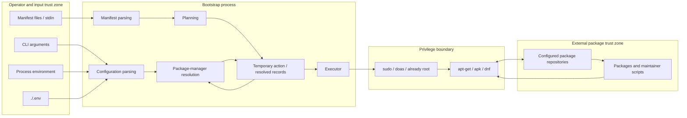
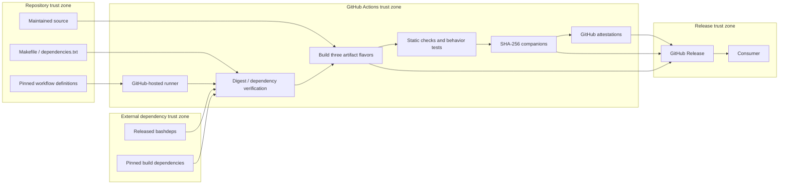

# Bootstrap Threat Model

Status: Draft

Last reviewed: 2026-08-30

## Purpose

This document describes the current threat model for Bootstrap.  It identifies
the assets Bootstrap is intended to protect, the actors and external systems that
participate in its operation, the trust assumptions on which it relies, the
boundaries across which data or authority moves, the threats that arise at those
boundaries, the controls implemented by the project, the responsibilities that
remain with users and operators, and the residual risks that remain after those
controls are considered.

This document follows
[ADR-054](adr/ADR-054-Maintain-a-STRIDE-Based-Threat-Model.md).  STRIDE is used as
the primary structured threat-enumeration method, supplemented by Bootstrap-
specific abuse cases and supply-chain analysis.

This threat model is an analytical aid.  It is not a warranty of security,
completeness, or absence of vulnerabilities.

## Scope

This model covers:

- the standalone Bootstrap runtime distributed as `bootstrap.dev.bash`,
  `bootstrap.bash`, and `bootstrap.min.bash`;
- command-line arguments and process environment consumed by Bootstrap;
- the optional `./.env` configuration file;
- manifest files and manifest content supplied through standard input;
- the parse, plan, resolve, and execute pipeline;
- temporary Action Record, Resolved Action, and Execution Result files;
- package-manager discovery and read-only package inspection;
- privilege escalation through `sudo` or `doas`;
- package installation through APT, APK, and DNF;
- configured operating-system package repositories;
- development and build dependencies;
- the GitHub Actions build and release workflow;
- release artifacts, SHA-256 checksum companions, and GitHub provenance
  attestations; and
- security-relevant documentation that informs user behavior.

## Out of Scope

The following are outside the protection goals of Bootstrap itself:

- an attacker who already has unrestricted root control of the target host;
- an attacker who already controls the account executing Bootstrap to the extent
  that they can arbitrarily replace Bootstrap, its shell, or its runtime
  environment;
- vulnerabilities in Bash, the operating-system kernel, `sudo`, `doas`, native
  package managers, or standard platform utilities, except where Bootstrap's use
  of those components unnecessarily increases exposure;
- the semantic safety or trustworthiness of a package that a user deliberately
  requests from a configured repository;
- compromise of a package after it has been installed and leaves Bootstrap's
  execution boundary; and
- security properties that the configured native package manager or repository
  does not itself provide.

These exclusions do not mean that the corresponding risks disappear.  Where
Bootstrap depends on an external control, the dependency is documented as a trust
assumption or residual risk.

## Security Objectives

Bootstrap is designed to preserve the following security properties.

### Execution integrity

Only user intent that has passed through the documented configuration, parsing,
planning, and resolution boundaries should reach package execution.

Manifest and configuration data should not become shell code merely because it
contains shell metacharacters or shell-like syntax.

### Privilege containment

Privilege escalation should occur only at the package-operation boundary and only
through the supported `sudo`, `doas`, or already-root execution paths.

Unprivileged parsing, planning, and resolution should not gain elevated authority
merely because later package installation requires it.

### Predictable and inspectable behavior

Unsupported, malformed, or ambiguous input should fail conservatively rather than
silently changing meaning.

Users should be able to inspect planned behavior with `--dry-run` and
`--explain` before package installation occurs.

### Package-source delegation

Bootstrap should delegate package availability, version semantics where
supported, package authenticity, and repository trust to the native package
manager rather than implementing competing package-security mechanisms.

### Build and dependency integrity

External development and build dependencies should be identified, pinned where
practical, and verified against committed SHA-256 digests before they are
executed.

A normal `make build` should not silently acquire new dependency bytes from the
network.

### Release integrity and provenance

Published executable artifacts should be testable representations of maintained
source, accompanied by SHA-256 checksums and provenance attestations that allow a
consumer to verify artifact identity and origin.

### Availability

Bootstrap should fail rather than hang indefinitely where practical.  Package
installation is time-bounded when GNU `timeout` is available.

The project does not currently attempt to guarantee bounded processing time for
all possible hostile inputs or all package-manager operations.

### Confidentiality

Bootstrap is not intended to process application secrets or credentials as
manifest data.  It should avoid introducing unnecessary disclosure through
logging or diagnostics, while recognizing that manifest paths and package names
are intentionally visible operational data.

## Assets

The assets protected by this model include:

- integrity of the target operating system;
- integrity of installed package state;
- the authority granted to Bootstrap through root, `sudo`, or `doas`;
- the user's intended package selection;
- the user's intended package-manager selection and installation timeout;
- integrity of the parse, plan, resolve, and execute pipeline;
- integrity of Action Records, Resolved Actions, and Execution Results;
- integrity of Bootstrap source code;
- integrity of external build and development dependencies;
- integrity of generated release artifacts;
- integrity and authenticity evidence represented by checksum companions and
  provenance attestations;
- repository and release publication authority;
- availability of the target host during bootstrap operations; and
- operational information exposed in manifests, paths, diagnostics, and logs.

## Actors and External Systems

### User or operator

The person or automation invoking Bootstrap and selecting manifests,
configuration, environment, package repositories, and the execution context.

### Manifest or configuration supplier

A person, repository, automation system, or other source that supplies a
manifest, `.env` file, environment values, or filenames that the operator may
not have authored personally.

This actor may be trusted, partially trusted, or hostile.

### Same-host unprivileged attacker

An actor able to influence files, directories, environment state, `PATH`, or
other process-adjacent inputs without already having unrestricted control of the
account or root.

### Privilege broker

`sudo` or `doas`, when Bootstrap is not already running as root.

### Native package manager

APT, APK, or DNF and their associated package databases and native inspection
tools.

### Package repository and package publisher

The configured operating-system repositories and the publishers whose package
content the native package manager accepts.

### Build dependency publisher

The upstream source of `bashdeps`, Bash-Minifier, the Bash Doxygen filter, and
future external build or development dependencies.

### Contributor or maintainer

An actor able to propose or approve source, workflow, dependency-digest, or
release-related changes.

### GitHub and GitHub Actions

The repository host, Actions execution environment, release service, tokens,
OIDC and attestation infrastructure, and the pinned third-party actions used by
the project.

### Network attacker

An actor able to observe, interrupt, redirect, or modify network traffic but not
break the assumed cryptographic properties of TLS or SHA-256.

## Trust Assumptions

Bootstrap currently depends on the following assumptions.

1. The operating-system kernel and Bash interpreter execute correctly.
2. Standard utilities used by Bootstrap and its build process behave according to
   their documented interfaces.
3. `sudo` and `doas`, when used, enforce their configured privilege policy
   correctly.
4. The native package manager correctly applies the repository, signature,
   authenticity, and package-selection policies configured by the operator.
5. The operator understands that adding an untrusted package repository changes
   the package trust boundary independently of Bootstrap.
6. The process `PATH` used to locate commands such as `sudo`, `doas`, `apt-get`,
   `apk`, `dnf`, `rpm`, `dpkg-query`, `timeout`, and related utilities is not
   attacker-controlled.
7. The current working directory is not attacker-controlled when Bootstrap is
   allowed to consume `./.env`.
8. Files intentionally supplied as manifests have permissions and provenance
   appropriate for the authority with which Bootstrap will eventually install
   packages.
9. SHA-256 remains collision resistant for the integrity checks performed here.
10. Committed dependency digests and pinned third-party action commit SHAs have
    received meaningful review before being trusted.
11. GitHub repository authorization, Actions, Releases, `GITHUB_TOKEN`, and
    attestation infrastructure behave according to their documented security
    boundaries.
12. A user with unrestricted control of the executing account or root can replace
    enough of the execution environment that Bootstrap cannot provide an
    independent security boundary against that actor.

## Runtime Trust-Boundary Diagram

The most important runtime authority transition is from Bootstrap's resolved
package intent into a native package-manager invocation that may execute with
root authority.  Data accepted before that transition therefore deserves more
scrutiny than ordinary CLI data in a non-privileged utility.

## Build and Release Trust-Boundary Diagram

Committed digests protect dependency byte identity, and attestations provide
provenance evidence for released artifacts.  Neither mechanism proves that the
reviewed dependency, source, workflow, or resulting program is free from
malicious behavior or defects.

## Attack Surfaces

### AS-001: Release acquisition

Release executable files, checksum companions, GitHub attestations, mutable
`latest` release URLs, and any wrapper or automation that downloads and executes
Bootstrap.

### AS-002: Command-line arguments

Manifest paths, `--package-manager`, `--dry-run`, `--explain`, verbosity flags,
and future CLI values.

### AS-003: Current-directory configuration

The optional `./.env` file discovered automatically from the current working
directory.

### AS-004: Process environment

Supported `BOOTSTRAP_*` environment variables, `PATH`, `TMPDIR`, locale, and
other process state inherited from the invoking environment.

### AS-005: Manifest content and standard input

Package names, version constraints, comments, input length, number of entries,
and streams that may not terminate promptly.

### AS-006: Manifest source paths and internal record serialization

Manifest filenames are preserved for provenance inside pipe- and newline-
delimited internal records.

### AS-007: External command discovery and execution

Commands located through `PATH`, including package-manager tools, package
inspection utilities, `sudo`, `doas`, `timeout`, and standard utilities.

### AS-008: Privilege escalation

The transition from the invoking user's authority into root package-manager
execution.

### AS-009: Native package managers and configured repositories

Package metadata, repository state, package signatures, package contents,
maintainer scripts, and package-manager behavior.

### AS-010: Temporary files

Action, resolved-action, result, and per-manifest preflight files created through
`mktemp` under `${TMPDIR:-/tmp}`.

### AS-011: Build dependency acquisition

Network downloads of `bashdeps` and dependencies declared in `dependencies.txt`,
plus the committed digests that authorize those bytes.

### AS-012: GitHub Actions and release publication

Pinned third-party actions, GitHub-hosted runners, write-scoped job permissions,
`GITHUB_TOKEN`, tags, release creation, and attestation issuance.

### AS-013: Terminal and diagnostic output

Package names, manifest paths, error details, dry-run output, and explain output
rendered into a user's terminal or captured logs.

## Threat Register Summary

| ID | Surface | STRIDE | Summary | Residual state |
| --- | --- | --- | --- | --- |
| TM-001 | AS-001 | S, T, E | A substituted or unverified Bootstrap artifact is executed | Partially mitigated / user responsibility |
| TM-002 | AS-011, AS-012 | S, T, E | Compromised source, build, or release authority produces malicious but apparently valid artifacts | Transferred in part to platform and maintainer controls |
| TM-003 | AS-005 | T, E | Manifest or configuration text becomes shell code | Mitigated for direct shell evaluation |
| TM-004 | AS-005, AS-009 | T, E | A package token is interpreted as a package-manager option or special syntax | Partially mitigated; unresolved |
| TM-005 | AS-006 | T, E, R | A crafted manifest source path corrupts newline- or pipe-delimited internal records | Partially mitigated; unresolved |
| TM-006 | AS-003, AS-004 | T, D | Hostile `.env` or environment values alter backend selection or timeout behavior | Partially mitigated / user responsibility |
| TM-007 | AS-004, AS-007, AS-008 | S, T, I, E | Attacker-controlled `PATH` causes execution of a spoofed external command or privilege broker | User/environment responsibility; high impact |
| TM-008 | AS-009 | S, T, E | A compromised or malicious configured package repository supplies hostile packages | Transferred to package-manager and operator trust |
| TM-009 | AS-005, AS-009 | T | Version constraints are not fully enforced at execution and installed-state boundaries | Partially mitigated; unresolved |
| TM-010 | AS-008, AS-009 | T, D | Execution fails after earlier package changes, leaving partial system mutation | Accepted / native package-manager boundary |
| TM-011 | AS-005, AS-009 | D | Large, endless, or expensive input consumes unbounded preflight resources | Partially mitigated; accepted for now |
| TM-012 | AS-007, AS-009 | D | Package installation runs without a time bound when GNU `timeout` is absent | Explicitly accepted with warning |
| TM-013 | AS-010 | T, I | Temporary planning or result state is modified or exposed | Largely mitigated; environment assumption remains |
| TM-014 | AS-013 | S, R | Control characters in package names or paths create misleading terminal or log output | Partially mitigated; low direct authority |
| TM-015 | AS-013 | R | Package changes cannot later be attributed from Bootstrap output alone | Accepted; Bootstrap is not an audit system |
| TM-016 | AS-011 | S, T, E | A build dependency is substituted in transit or cache | Strongly mitigated by committed digests |
| TM-017 | AS-012 | S, T, E | A GitHub Action, runner, token, or GitHub platform compromise alters a release | Transferred in part to GitHub and repository governance |
| TM-018 | AS-001 | S, T | Checksums or attestations are treated as stronger guarantees than they provide | User responsibility / documentation control |
| TM-019 | AS-005, AS-008, AS-009 | T, E | An untrusted but syntactically valid manifest requests unintended packages | User responsibility with inspectability controls |

## Detailed Threat Analysis

### TM-001: Release artifact substitution

**Surface:** AS-001

**STRIDE:** Spoofing, Tampering, Elevation of Privilege

**Scenario:** An attacker replaces `bootstrap.bash`, serves a different file from
an unofficial location, compromises a local cached copy, or persuades a user to
execute an artifact whose provenance has not been verified.  Because Bootstrap
may later invoke package operations with root authority, a malicious replacement
could execute arbitrary code before Bootstrap's own runtime controls exist.

**Impact:** Arbitrary code execution with the authority of the invoking user and,
if the replacement invokes or inherits privilege, potentially root compromise.

**Project controls:**

- three standalone release artifacts are produced through the documented build
  process;
- each executable has a SHA-256 checksum companion;
- the release workflow verifies all checksum companions before publication;
- GitHub provenance attestations cover all executables and checksum companions;
- all three executable flavors are run through the same behavior test suite;
- release artifacts are tested after `vendor/` is removed; and
- project documentation warns against unreviewed `curl | bash` execution and
  describes inspectable alternatives.

**User or operator controls:**

- acquire artifacts from the expected GitHub repository and release;
- prefer a version-pinned release URL for automation rather than an unqualified
  mutable `latest` URL when reproducibility matters;
- verify the artifact against its checksum companion;
- verify the GitHub provenance attestation when stronger provenance evidence is
  needed;
- inspect the downloaded script, or use an inspection-oriented mechanism such as
  `vet`, before first execution; and
- protect local cached copies against modification by other users.

**Residual risk:** Partially mitigated.  Checksum verification establishes byte
identity with the expected checksum.  Attestation establishes provenance claims
within GitHub's trust model.  Neither proves that the source itself is benign.
A consumer who downloads and executes without verification accepts the release
channel as the effective trust root.

**Evidence:**

- [`Makefile`](../Makefile)
- [`.github/workflows/semver.yml`](../.github/workflows/semver.yml)
- [`doc/release-verification.md`](release-verification.md)
- [`README.md`](../README.md)
- ADR-029, ADR-052, and ADR-053

### TM-002: Compromised source, build, or release authority

**Surface:** AS-011, AS-012

**STRIDE:** Spoofing, Tampering, Elevation of Privilege

**Scenario:** A maintainer credential, repository authorization boundary, trusted
workflow, runner, or release token is compromised.  The attacker changes source
or build inputs and produces artifacts whose checksums and attestations are
internally consistent because the compromise occurred before those controls were
created.

**Impact:** Publication of malicious release artifacts with apparently valid
project-controlled integrity metadata.

**Project controls:**

- third-party GitHub Actions used by the release workflow are pinned to commit
  SHAs;
- dependency digests are committed in reviewed repository source;
- the release workflow performs dependency verification, static checking, tests,
  build, checksum verification, independence checks, attestation, and publication
  as separate visible steps;
- workflow permissions are declared explicitly; and
- source, workflows, ADRs, and dependency trust data are version controlled and
  reviewable.

**User or operator controls:**

- treat checksum verification as integrity evidence rather than an independent
  guarantee of source trust;
- verify provenance attestations where appropriate;
- inspect repository history and release provenance for high-trust
  environments; and
- pin known-good versions where operationally appropriate.

**Residual risk:** Partially transferred to GitHub, repository governance,
maintainer credential security, and the integrity of reviewed source.  A fully
authorized malicious source change can produce correctly checksummed and
attested malicious artifacts.

**Evidence:**

- [`.github/workflows/semver.yml`](../.github/workflows/semver.yml)
- [`dependencies.txt`](../dependencies.txt)
- [`Makefile`](../Makefile)
- ADR-051, ADR-052, and ADR-053

### TM-003: Shell command injection through manifest or configuration data

**Surface:** AS-003, AS-004, AS-005

**STRIDE:** Tampering, Elevation of Privilege

**Scenario:** A manifest or `.env` value contains semicolons, command
substitutions, backticks, quotes, glob syntax, or other text that would be
dangerous if evaluated as shell code.

**Impact:** If the data were evaluated, arbitrary code could execute before or
during privileged package operations.

**Project controls:**

- `.env` is parsed as data and is never sourced;
- the `.env` parser intentionally omits shell expansion, command substitution,
  escape processing, and nested quoting;
- only known `BOOTSTRAP_` file-based configuration keys are accepted;
- the manifest parser uses a deliberately small grammar;
- package, operator, and version data are passed as quoted shell arguments;
- the pipeline does not use `eval` to execute manifest content; and
- the executor consumes resolved fields rather than shell command strings.

**User or operator controls:**

- continue treating manifests as package intent, not as shell scripts;
- do not assume that syntactically valid package-manager-specific text is
  necessarily semantically safe; and
- review manifests received from untrusted sources.

**Residual risk:** Mitigated for direct shell-language injection through ordinary
manifest and `.env` data.  This does not mitigate package-manager option or
special-syntax interpretation, which is tracked separately as TM-004.

**Evidence:**

- [`lib/runtime/config.bash`](../lib/runtime/config.bash)
- [`lib/manifest/parser.bash`](../lib/manifest/parser.bash)
- [`lib/executor/executor.bash`](../lib/executor/executor.bash)
- ADR-014, ADR-035, ADR-047, and ADR-048

### TM-004: Package-manager option or special-syntax injection

**Surface:** AS-005, AS-009

**STRIDE:** Tampering, Elevation of Privilege

**Scenario:** A manifest package token begins with `-` or otherwise uses syntax
that the selected native package manager interprets as an option or control
construct rather than a package name.  The manifest grammar currently rejects
whitespace and selected delimiters, but it does not require a package token to
begin with an ordinary package-name character.  Executors pass the resulting
token to `apt-get`, `apk`, or `dnf` as a quoted argument.  Shell quoting prevents
shell injection but does not prevent the called program from interpreting the
argument as an option.

**Impact:** Package-manager behavior may be changed at the privileged execution
boundary.  Depending on the package manager and accepted option, this could
weaken repository verification, change repositories or roots, alter transaction
behavior, or otherwise exceed the package-selection authority the manifest was
intended to express.

**Project controls:**

- manifest fields are shell-quoted;
- resolution asks the selected backend to confirm package availability before
  execution;
- only supported package managers and action types are dispatched; and
- unsupported behavior fails conservatively.

These controls reduce accidental interpretation but do not establish that a
leading-hyphen or other special token cannot be interpreted as a native
package-manager option.

**User or operator controls:**

- review untrusted manifests before execution;
- use `--dry-run --explain` before applying unfamiliar manifests; and
- reject suspicious package tokens, especially values beginning with `-`.

**Residual risk:** Partially mitigated and unresolved.  A project-side grammar or
backend hardening change should ensure that package intent cannot become
package-manager option intent.  Dry-run output is useful but does not currently
render the exact eventual package-manager command line, so it is not a complete
mitigation for this threat.

**Evidence:**

- [`lib/manifest/parser.bash`](../lib/manifest/parser.bash)
- [`lib/backend/apt.bash`](../lib/backend/apt.bash)
- [`lib/backend/apk.bash`](../lib/backend/apk.bash)
- [`lib/backend/dnf.bash`](../lib/backend/dnf.bash)
- [`lib/executor/apt.bash`](../lib/executor/apt.bash)
- [`lib/executor/apk.bash`](../lib/executor/apk.bash)
- [`lib/executor/dnf.bash`](../lib/executor/dnf.bash)

### TM-005: Internal record injection through manifest source paths

**Surface:** AS-006

**STRIDE:** Tampering, Elevation of Privilege, Repudiation

**Scenario:** A manifest filename contains `|`, a newline, or another value that
conflicts with the plain-text record encoding.  Package, operator, and version
fields are constrained by the manifest grammar, but the source path preserved for
provenance is inserted directly into newline- and pipe-delimited Manifest Entry,
Action Record, and Resolved Action streams.

A newline in a source path can create an additional physical record line.
A pipe can shift provenance fields.  Because later stages parse the record stream
with `IFS='|'` and line-oriented reads, a crafted path can change the meaning of
the internal stream independently of the manifest's visible package content.

**Impact:** Corrupted provenance, misleading dry-run or diagnostic output, and
potential creation of unintended synthetic action records that may eventually
cross the privileged package-execution boundary if they also satisfy resolver
checks.

**Project controls:**

- package and version fields exclude the record delimiter;
- each manifest is preflighted into a private temporary file before being
  appended to the invocation plan;
- all manifests must parse, plan, and resolve before execution begins; and
- unsupported or malformed action types fail conservatively.

The source path itself is not currently encoded or constrained for the internal
record format.

**User or operator controls:**

- avoid processing manifests with control characters or record delimiters in
  their filenames;
- inspect shell glob expansions when manifests originate in an untrusted
  directory; and
- use dry-run when consuming manifests from repositories or archives not under
  the operator's control.

**Residual risk:** Partially mitigated and unresolved.  Internal record
serialization should encode fields or explicitly reject source paths that cannot
be represented safely.

**Evidence:**

- [`lib/manifest/parser.bash`](../lib/manifest/parser.bash)
- [`lib/planner/planner.bash`](../lib/planner/planner.bash)
- [`lib/planner/action-record.bash`](../lib/planner/action-record.bash)
- [`lib/resolver/resolver.bash`](../lib/resolver/resolver.bash)
- [`src/bootstrap.bash`](../src/bootstrap.bash)
- ADR-047, ADR-048, and ADR-049

### TM-006: Configuration poisoning through `./.env` or process environment

**Surface:** AS-003, AS-004

**STRIDE:** Tampering, Denial of Service

**Scenario:** Bootstrap is launched from a directory containing an attacker-
controlled `.env`, or from a process environment whose supported
`BOOTSTRAP_*` values have been influenced by another actor.  The attacker changes
package-manager selection or installation timeout without modifying the manifest.

**Impact:** Bootstrap may choose a different supported backend, fail
unexpectedly, or use an attacker-selected timeout.  The configuration surface
does not currently provide arbitrary command execution, but it can alter
operational behavior.

**Project controls:**

- the default file lookup is limited to exactly `./.env`;
- `.env` is parsed as data rather than sourced;
- file-based unknown `BOOTSTRAP_` keys fail closed;
- only documented supported settings are consumed from the process environment;
- CLI configuration has higher precedence than environment configuration; and
- final values are validated against an explicit package-manager allowlist and a
  positive-integer timeout requirement.

**User or operator controls:**

- run Bootstrap from a trusted current working directory;
- inspect repository-local `.env` files before privileged package operations;
- sanitize inherited environment values in automation;
- use explicit CLI configuration where the execution environment is shared or
  difficult to reason about.

**Residual risk:** Partially mitigated.  Automatic current-directory
configuration is intentionally convenient and therefore makes the working
directory part of the trust model.

**Evidence:**

- [`lib/runtime/config.bash`](../lib/runtime/config.bash)
- [`doc/cli.md`](cli.md)
- ADR-023

### TM-007: External command or privilege-broker hijacking through `PATH`

**Surface:** AS-004, AS-007, AS-008

**STRIDE:** Spoofing, Tampering, Information Disclosure, Elevation of Privilege

**Scenario:** An attacker places a malicious executable earlier in `PATH` under a
trusted command name such as `sudo`, `doas`, `apt-get`, `apk`, `dnf`, `rpm`,
`dpkg-query`, or another utility Bootstrap invokes.  Bootstrap discovers and
executes commands by name rather than by a project-verified absolute path.

A spoofed `sudo` or `doas` could also imitate a password prompt and capture user
credentials.  If Bootstrap is already running as root, a spoofed package-manager
or utility found through an attacker-controlled `PATH` could execute directly
with root authority.

**Impact:** Arbitrary code execution with the authority of the Bootstrap process,
credential theft, incorrect platform detection, or root compromise.

**Project controls:**

- the set of command names used by Bootstrap is explicit and small;
- privilege selection is centralized;
- missing required commands cause conservative failure; and
- no arbitrary external command name is read from the manifest.

Bootstrap does not currently authenticate command paths or sanitize `PATH` before
security-sensitive command discovery and execution.

**User or operator controls:**

- execute Bootstrap with a trusted, predictable `PATH`;
- avoid running privileged Bootstrap operations in environments where another
  user can write to directories appearing earlier in `PATH`;
- use standard root and `sudo` secure-path practices; and
- do not preserve attacker-controlled environment state when invoking Bootstrap
  through privilege boundaries.

**Residual risk:** User/environment responsibility with high potential impact.
Future hardening may validate discovered command paths or establish a sanitized
execution path, but such a change must account for portability.

**Evidence:**

- [`lib/runtime/privilege.bash`](../lib/runtime/privilege.bash)
- [`lib/backend/apt.bash`](../lib/backend/apt.bash)
- [`lib/backend/apk.bash`](../lib/backend/apk.bash)
- [`lib/backend/dnf.bash`](../lib/backend/dnf.bash)

### TM-008: Compromised package repository or malicious package

**Surface:** AS-009

**STRIDE:** Spoofing, Tampering, Elevation of Privilege

**Scenario:** A configured package repository is compromised, a repository is
malicious, its signing or publication authority is compromised, or a package
publisher releases malicious content under a package name the operator requests.

Native packages may execute maintainer scripts with root authority as part of
installation.

**Impact:** Root-level code execution, persistent system compromise, data loss,
or installation of attacker-controlled software.

**Project controls:**

- Bootstrap delegates package discovery and installation to the native package
  manager;
- it does not implement an alternate unauthenticated package-download path;
- package-manager selection is constrained to supported backends; and
- package availability is resolved before execution.

**User or operator controls:**

- configure only repositories and signing authorities appropriate for the host;
- protect repository configuration from unauthorized modification;
- review third-party repository instructions before adding them;
- understand that a valid manifest can request any package trusted by the native
  package-manager configuration.

**Residual risk:** Transferred to the native package manager, configured
repositories, package publishers, and operator repository policy.  Delegation
does not eliminate the risk.

**Evidence:**

- [`lib/backend/`](../lib/backend/)
- [`lib/executor/`](../lib/executor/)
- ADR-003 and ADR-017

### TM-009: Version constraint drift or incomplete execution enforcement

**Surface:** AS-005, AS-009

**STRIDE:** Tampering

**Scenario:** A manifest uses an APT version constraint as an integrity or
compatibility boundary.  The APT backend checks the repository candidate during
resolution, but the current APT executor does not pass an explicit constrained
version to `apt-get` and treats any already-installed package as
`already-satisfied` without re-evaluating the requested version.

Repository metadata may also change between resolution and execution.

**Impact:** The final installed state can differ from the version intent that was
validated during planning.  If the constraint was intended to avoid a vulnerable
or incompatible version, this becomes security relevant.

**Project controls:**

- APT candidate versions are evaluated using native `dpkg --compare-versions`
  semantics during resolution;
- unsupported version-constraint capability for APK and DNF fails before
  execution; and
- version fields remain attached to records for future backend-specific
  enforcement.

**User or operator controls:**

- do not treat a Bootstrap version constraint as an independent package pin until
  execution enforcement matches the documented constraint semantics;
- verify installed versions after security-sensitive bootstrap operations; and
- use native repository pinning or package-policy controls when exact package
  version selection is a security requirement.

**Residual risk:** Partially mitigated and unresolved.  Execution should verify
that the resulting installed state satisfies the resolved version intent.

**Evidence:**

- [`lib/backend/apt.bash`](../lib/backend/apt.bash)
- [`lib/executor/apt.bash`](../lib/executor/apt.bash)
- [`lib/resolver/resolver.bash`](../lib/resolver/resolver.bash)

### TM-010: Partial system mutation after execution failure

**Surface:** AS-008, AS-009

**STRIDE:** Tampering, Denial of Service

**Scenario:** All manifests successfully preflight, execution begins, several
packages install, and a later package fails or times out.  Bootstrap stops at the
failure but does not roll back earlier successful package-manager transactions.

**Impact:** The system is left in a partially applied state that differs from the
complete desired manifest state.  A deliberately ordered manifest could exploit
this property to cause selected changes before forcing failure.

**Project controls:**

- every manifest is parsed, planned, and resolved before the first mutation;
- a failed preflight causes zero package changes;
- execution stops at the first failed action;
- native package managers own their own transaction semantics; and
- execution results identify success, failure, and already-satisfied outcomes.

**User or operator controls:**

- use `--dry-run --explain` before consequential runs;
- understand that preflight is all-or-nothing but package installation across
  multiple actions is not a cross-package transaction;
- use host snapshots, image-based rebuilds, or package-manager recovery
  capabilities where rollback is operationally required.

**Residual risk:** Accepted at the project boundary.  Cross-package rollback is
not currently provided.

**Evidence:**

- [`src/bootstrap.bash`](../src/bootstrap.bash)
- [`lib/executor/executor.bash`](../lib/executor/executor.bash)
- ADR-049 and ADR-050

### TM-011: Resource exhaustion through large or non-terminating input

**Surface:** AS-005, AS-009

**STRIDE:** Denial of Service

**Scenario:** A manifest contains an extremely large number of entries, very
large lines, or standard input remains open indefinitely.  Resolution may invoke
a native package-manager query for each planned package.

**Impact:** Excessive CPU, memory, disk, package-manager work, network metadata
activity, or elapsed time.  Preflight may never reach execution or completion.

**Project controls:**

- the parser processes input line by line rather than reading entire manifests
  into one shell variable;
- malformed input fails conservatively;
- installation commands are separately time-bounded when GNU `timeout` is
  available.

Bootstrap does not currently impose manifest byte limits, line limits, entry
limits, stdin duration limits, or a global preflight deadline.

**User or operator controls:**

- do not feed unbounded streams from untrusted producers directly into privileged
  bootstrap automation;
- inspect generated manifests and constrain upstream producers;
- use host-level process limits or outer timeouts in hostile or multi-tenant
  environments.

**Residual risk:** Partially mitigated and accepted for now.  Bootstrap is not
currently designed as a hostile multi-tenant service.

**Evidence:**

- [`lib/manifest/parser.bash`](../lib/manifest/parser.bash)
- [`src/bootstrap.bash`](../src/bootstrap.bash)

### TM-012: Unbounded package installation when GNU `timeout` is absent

**Surface:** AS-007, AS-009

**STRIDE:** Denial of Service

**Scenario:** The target system lacks GNU `timeout`.  A package manager or package
installation hangs indefinitely.

**Impact:** Bootstrap does not complete, automation remains blocked, and a
privileged package-manager process may remain active indefinitely.

**Project controls:**

- Bootstrap uses GNU `timeout` when it is available;
- installation timeout is explicit and validated;
- if `timeout` is unavailable, Bootstrap emits a warning once per invocation
  before continuing; and
- the absence of timeout is visible rather than silently ignored.

**User or operator controls:**

- provide GNU `timeout` where bounded installation is required;
- wrap Bootstrap in an outer supervisor or job timeout in automation;
- investigate repositories or package-manager states that repeatedly hang.

**Residual risk:** Explicitly accepted for portability when GNU `timeout` is
unavailable.

**Evidence:**

- [`lib/runtime/privilege.bash`](../lib/runtime/privilege.bash)
- ADR-050

### TM-013: Temporary plan or result file tampering or disclosure

**Surface:** AS-010

**STRIDE:** Tampering, Information Disclosure

**Scenario:** Another local actor attempts to read or replace temporary files
containing planned packages, resolved package-manager bindings, manifest
provenance, or execution results.

**Impact:** Disclosure of package intent and manifest paths, corruption of the
internal execution plan, or unintended package execution if an attacker can alter
resolved records before execution.

**Project controls:**

- temporary files are created using `mktemp` rather than predictable filenames;
- per-manifest plans are only appended after successful planning;
- temporary files are removed on success and failure paths;
- the action and resolved streams are regenerated for each invocation.

**User or operator controls:**

- use a trusted `TMPDIR`;
- do not set `TMPDIR` to a directory whose ownership or semantics are not
  appropriate for the invoking account;
- protect the executing account from same-user compromise.

**Residual risk:** Largely mitigated under standard `mktemp` semantics and a
trusted temporary directory.  A process-level attacker with the same user's
authority is generally outside Bootstrap's independent protection boundary.

**Evidence:**

- [`src/bootstrap.bash`](../src/bootstrap.bash)

### TM-014: Terminal or log control-sequence injection

**Surface:** AS-013

**STRIDE:** Spoofing, Repudiation

**Scenario:** A package token or manifest path contains control characters that
are printed with `%s` into terminal, diagnostic, dry-run, or explain output.
The text is not shell-evaluated, but terminal escape sequences or embedded
newlines can change visual presentation.

**Impact:** Misleading output, hidden or overwritten warnings, forged-looking log
lines, or confusing provenance.  Depending on terminal behavior, more exotic
terminal-side effects may be possible.

**Project controls:**

- output formatting is centralized;
- variable text is passed as data to `printf` format arguments rather than used
  as the format string;
- warning and error output is not suppressed by `--quiet`.

**User or operator controls:**

- avoid manifests and filenames containing terminal control characters;
- inspect suspicious output through a representation that makes non-printing
  characters visible;
- do not treat terminal rendering as a cryptographically trustworthy audit log.

**Residual risk:** Partially mitigated.  Output values are not currently escaped
for terminal control characters.

**Evidence:**

- [`lib/runtime/logging.bash`](../lib/runtime/logging.bash)
- [`src/bootstrap.bash`](../src/bootstrap.bash)

### TM-015: Insufficient auditability for later attribution

**Surface:** AS-013

**STRIDE:** Repudiation

**Scenario:** After Bootstrap changes a system, an operator needs to prove which
human, automation, manifest revision, or environment caused the invocation.
Bootstrap's normal output contains useful source and line provenance but is not a
tamper-evident audit trail and does not establish caller identity.

**Impact:** Incomplete forensic attribution or change-accountability evidence.

**Project controls:**

- manifest source and line number are preserved into planning and explanation;
- execution results are structured;
- deterministic planning and explicit configuration improve reconstructability.

**User or operator controls:**

- capture Bootstrap output in the surrounding automation or system audit
  facility when attribution is required;
- preserve the manifest revision and invocation context;
- use host auditing, CI job identity, or configuration-management records for
  formal accountability.

**Residual risk:** Accepted.  Bootstrap is an execution tool, not an identity or
tamper-evident audit system.

**Evidence:**

- [`lib/manifest/parser.bash`](../lib/manifest/parser.bash)
- [`lib/planner/action-record.bash`](../lib/planner/action-record.bash)
- [`lib/executor/execution-result.bash`](../lib/executor/execution-result.bash)

### TM-016: Build dependency substitution

**Surface:** AS-011

**STRIDE:** Spoofing, Tampering, Elevation of Privilege

**Scenario:** An attacker modifies a downloaded `bashdeps` artifact, a cached
build dependency, or an upstream dependency download in transit.

**Impact:** Malicious code executes in the developer or CI build environment and
may alter generated release artifacts.

**Project controls:**

- the `bashdeps` bootstrap version and SHA-256 digest are committed in the
  Makefile;
- a cached `bashdeps` file is verified before use;
- replacement bytes are downloaded to a staging file and moved into place only
  after digest verification;
- ordinary dependencies in `dependencies.txt` are pinned and include committed
  SHA-256 digests;
- `make deps-check` verifies already-present dependency state without network
  repair;
- `make build` itself is network-free and requires prepared dependency state.

**User or operator controls:**

- review dependency version, URL, and digest changes as security-sensitive code
  changes;
- protect the repository and vendor directory from unauthorized local
  modification;
- run `make deps-check` when validating prepared build state.

**Residual risk:** Strongly mitigated for byte substitution after a digest is
trusted.  The project still trusts the correctness and safety of the dependency
bytes represented by the committed digest, as well as SHA-256 collision
resistance.

**Evidence:**

- [`Makefile`](../Makefile)
- [`dependencies.txt`](../dependencies.txt)
- ADR-051

### TM-017: GitHub Actions, runner, token, or platform compromise

**Surface:** AS-012

**STRIDE:** Spoofing, Tampering, Elevation of Privilege

**Scenario:** A pinned action commit is malicious, GitHub Actions or a hosted
runner is compromised, workflow execution is manipulated, or the release job's
write-capable token is abused.

**Impact:** Source-derived artifacts, tags, attestations, or published releases
can be altered or replaced within the authority granted to the workflow.

**Project controls:**

- third-party actions in the release workflow are pinned to immutable-looking
  commit SHAs rather than floating tags;
- workflow permissions are explicit and narrower at the workflow level, with
  write permissions granted to the release job where required;
- release creation happens only after dependency verification, static checking,
  tests, build, checksum verification, and artifact-independence checks;
- attestations are generated before release upload.

**User or operator controls:**

- maintain strong GitHub account and repository governance;
- review workflow and pinned-action changes carefully;
- verify release provenance when consuming artifacts in higher-trust
  environments.

**Residual risk:** Partially transferred to GitHub and the security of pinned
third-party action code.  Pinning prevents an upstream tag from silently moving,
but it does not prove that the pinned commit is benign.

**Evidence:**

- [`.github/workflows/semver.yml`](../.github/workflows/semver.yml)

### TM-018: Over-trusting checksums or attestations

**Surface:** AS-001

**STRIDE:** Spoofing, Tampering

**Scenario:** A consumer treats a `.sha256` companion as proof that an artifact is
safe, or treats a provenance attestation as proof that the source contains no
malicious logic.  A checksum obtained from the same compromised release channel
as the executable can be internally consistent with malicious bytes.

**Impact:** A user executes a malicious or defective artifact while believing the
integrity metadata provides a guarantee it does not actually provide.

**Project controls:**

- release documentation distinguishes integrity verification from source
  correctness;
- checksum companions use a conventional format;
- attestations provide an additional provenance mechanism;
- development artifacts preserve comments to improve inspectability.

**User or operator controls:**

- use checksums to verify byte identity, not semantic safety;
- use attestations to verify supported provenance claims, not code correctness;
- inspect source or rely on additional organizational review where semantic trust
  is required.

**Residual risk:** User responsibility informed by project documentation.
Integrity and provenance controls necessarily stop short of proving benign
behavior.

**Evidence:**

- [`doc/release-verification.md`](release-verification.md)
- [`README.md`](../README.md)
- ADR-029, ADR-052, and ADR-053

### TM-019: Untrusted manifest requests unintended packages

**Surface:** AS-005, AS-008, AS-009

**STRIDE:** Tampering, Elevation of Privilege

**Scenario:** A manifest supplier does not exploit a parser bug at all.  The
manifest is syntactically valid and requests packages the operator did not intend
to install.  Bootstrap correctly plans and installs those packages using
privileged native package-manager operations.

**Impact:** Installation of unwanted software, activation of package maintainer
scripts, expanded attack surface, or system configuration changes associated with
the requested packages.

**Project controls:**

- manifests are deliberately declarative and small enough to review;
- parser, planner, resolver, and executor responsibilities are separated;
- all manifests preflight before execution;
- `--dry-run` and `--explain` allow inspection without mutation;
- package installation is delegated to the native package manager.

**User or operator controls:**

- treat manifest authorship as a security-relevant source of package-selection
  authority;
- review unfamiliar manifests before execution;
- use `--dry-run --explain` when adopting manifests from another repository or
  person;
- do not assume that "valid manifest" means "trusted package selection."

**Residual risk:** User responsibility.  Bootstrap cannot determine whether a
legitimate package request matches the operator's human intent.

**Evidence:**

- [`doc/manifest-format.md`](manifest-format.md)
- [`src/bootstrap.bash`](../src/bootstrap.bash)
- ADR-007, ADR-014, ADR-015, ADR-016, and ADR-049

## Abuse and Misuse Cases

### A trusted-looking repository contains a hostile manifest

An operator clones a repository they expect to be benign and runs Bootstrap
against its manifest.  The manifest contains no shell code and therefore bypasses
no parser control.  It simply names unwanted packages.

Bootstrap's protection is inspectability, not semantic intent inference.  The
operator must treat manifest review as equivalent to reviewing privileged package
selection.

### A package token is crafted to influence native package-manager options

A manifest supplier chooses a token beginning with `-`.  Shell quoting keeps the
token from becoming shell syntax, but the native package manager may interpret
it as an option.  This crosses from data semantics into native-tool control
semantics and is tracked as TM-004.

### A repository contains a manifest filename with record delimiters

An operator runs a shell glob such as `*.manifest` in a repository whose filenames
were chosen by another party.  A crafted filename contains a newline or `|`.
Bootstrap preserves that source name inside its current plain-text internal
records, potentially changing record structure even though the manifest content
itself appears harmless.  This is tracked as TM-005.

### A malicious local directory influences an otherwise trusted invocation

The user invokes a trusted Bootstrap artifact from a directory containing an
attacker-controlled `.env`, or with an attacker-influenced `PATH`.  The artifact
itself is authentic, but the surrounding execution context changes backend,
timeout, command discovery, or privilege behavior.  This is tracked as TM-006 and
TM-007.

### A correctly signed repository distributes a malicious package

The configured package manager successfully authenticates a package from a
repository the operator chose to trust.  The package itself is malicious or has
a compromised maintainer script.  Bootstrap cannot distinguish this from an
ordinary trusted package install.  This is tracked as TM-008.

### A release is malicious before its checksum is calculated

A source, build, or workflow compromise alters the generated artifact before
checksum and attestation steps.  The release metadata is consistent with the
malicious file.  This illustrates why checksum and attestation controls protect
different properties from source review and repository governance.  This is
tracked as TM-002 and TM-018.

## Residual and Accepted Risks

The following residual risks are especially important to preserve as explicit
project knowledge.

1. Bootstrap trusts the operator's configured package-manager repository policy.
2. Bootstrap trusts a sane execution `PATH`; security-sensitive commands are not
   currently authenticated by absolute path or another project-controlled
   mechanism.
3. Package tokens are not currently hardened against native package-manager
   option interpretation.
4. Manifest source paths are not currently encoded before entering internal
   delimiter-based record streams.
5. APT version constraints are checked during resolution but are not fully
   enforced against already-installed state or the final install command.
6. Execution across several packages is not transactional.  Earlier successful
   package changes are not rolled back when a later action fails.
7. Preflight work has no global input-size, entry-count, or elapsed-time bound.
8. Package installation may be unbounded when GNU `timeout` is unavailable.
9. Terminal output is not escaped for arbitrary control characters in
   user-influenced values.
10. GitHub Actions and Releases remain part of the trusted build and publication
    infrastructure.
11. A committed dependency digest proves identity with approved bytes, not that
    those bytes are safe.
12. A release checksum and provenance attestation do not prove semantic
    correctness.
13. A valid manifest can intentionally request software the operator should not
    trust; human or organizational review remains necessary.

## Validation and Evidence

The following project controls provide evidence relevant to this threat model.

### Runtime and behavior tests

The Bats suite exercises maintained behavior, and `make test` applies the same
behavior suite to the development, stripped, and minified executable flavors.

Relevant areas include:

- manifest parsing and malformed-input behavior;
- configuration precedence and validation;
- planner and resolver behavior;
- dry-run behavior;
- executor behavior;
- package-manager backends;
- regression coverage; and
- execution summaries.

See [`tests/`](../tests/) and [`doc/testing.md`](testing.md).

### End-to-end package-manager tests

Containerized end-to-end environments exercise APT, APK, and DNF installation
paths.

See [`tests/e2e/`](../tests/e2e/) and the `test-e2e-*` Make targets.

### Static and repository analysis

The project uses ShellCheck, MegaLinter, CodeQL, OpenSSF Scorecard, and related
repository checks as additional evidence.  These tools can detect classes of
problems but are not treated as proof that a threat is impossible.

### Build dependency verification

The `bashdeps` bootstrap is verified against a SHA-256 digest committed in the
Makefile before execution.  Manifest-managed build dependencies carry committed
SHA-256 digests in `dependencies.txt`.

`make deps-check` verifies prepared dependency state without network repair.

### Release validation

The release workflow:

1. synchronizes and verifies build dependencies;
2. runs static checks and the behavior test suite;
3. builds all three executable flavors;
4. verifies all three SHA-256 companions;
5. removes `vendor/` and confirms that all released executables still run
   independently;
6. attests the six release files; and
7. publishes them through GitHub Releases.

### Architectural evidence

Security-relevant architectural decisions include, among others:

- ADR-007, inspectable and reviewable execution;
- ADR-013, conservative failure;
- ADR-014, separation of parsing and installation;
- ADR-015, planning before system changes;
- ADR-016, dry-run and explain modes;
- ADR-017, native package-manager delegation;
- ADR-023, explicit configuration;
- ADR-027, trust through inspectability;
- ADR-029, reproducible and verifiable releases;
- ADR-035, data over code;
- ADR-042, minimizing the trusted computing base;
- ADR-047, immutable Action Records;
- ADR-048, execution consuming Resolved Actions;
- ADR-049, preflighting all manifests before execution;
- ADR-050, bounded package installation;
- ADR-051, build dependency management;
- ADR-052, release artifact flavors;
- ADR-053, SHA-256 checksum companion naming; and
- ADR-054, STRIDE-based threat modeling.

## Review Triggers

This threat model should be reviewed when a change:

- adds a new manifest feature or new input grammar;
- changes accepted package-name syntax;
- changes internal Action Record or Resolved Action serialization;
- changes `.env`, environment, or CLI configuration behavior;
- adds a new package-manager backend;
- changes package-manager command construction;
- changes package-version semantics;
- changes privilege escalation or root execution behavior;
- changes external command discovery or `PATH` assumptions;
- adds filesystem writes or persistent state outside native package-manager
  behavior;
- adds network access to the Bootstrap runtime;
- changes temporary-file handling;
- adds or changes a runtime, build, development, or release dependency;
- changes dependency digest verification;
- changes build artifact construction;
- changes checksum, signing, attestation, or provenance behavior;
- changes GitHub Actions workflow permissions or release publication;
- adds authentication, authorization, credential, secret, or sensitive-data
  handling;
- discovers a vulnerability or incident that invalidates an assumption in this
  document; or
- adopts an ADR that changes an asset, actor, trust boundary, attack surface,
  control, or accepted risk described here.

The `Last reviewed` date should change only when the model has actually been
reviewed against the then-current architecture.

## Security Follow-Up Candidates

This section records hardening opportunities exposed by the model.  It is not a
commitment to a particular implementation or ordering.

### Reject or safely terminate package-manager option syntax

The manifest grammar should prevent package intent from becoming package-manager
option intent, or each backend should use a native argument-termination mechanism
that is verified for that package manager.

This follows from TM-004.

### Encode internal records or constrain provenance fields

Internal records should use an encoding that cannot be structurally altered by a
manifest source path, or source paths should be validated before entering the
record stream.

This follows from TM-005.

### Enforce version intent at execution

APT execution should verify that already-installed state satisfies the requested
constraint and that the final install operation cannot drift from the resolved
version intent.

This follows from TM-009.

### Revisit security-sensitive command discovery

The project should decide whether to retain the trusted-`PATH` assumption,
sanitize `PATH`, validate discovered command locations, or use another portable
strategy for security-sensitive external commands.

This follows from TM-007.

### Consider bounded preflight behavior

If Bootstrap is expected to consume machine-generated or less-trusted manifests,
the project should consider whether entry-count, input-size, or outer preflight
time limits are appropriate.

This follows from TM-011.

### Review download helper verification

Documentation and helper examples that automatically download an executable
should be reviewed to determine whether they should also verify the corresponding
checksum or provenance before execution.

This follows from TM-001 and TM-018.

## Relationship to Other Security Documentation

This document describes the current security model.

[`SECURITY.md`](../SECURITY.md) describes how to report a vulnerability or
security concern.

Architecture Decision Records explain why security-relevant design choices were
made.

Tests, CI configuration, checksums, and attestations provide evidence for
specific controls but do not replace the threat model.

## Closing Statement

Bootstrap intentionally converts compact human-authored package intent into
native package-manager operations that may execute with root authority.  The
project's security posture therefore depends on keeping that conversion
inspectable, constrained, and explicit.

The strongest current controls are the separation of data from shell code, the
parse-plan-resolve-execute pipeline, complete preflight before mutation, native
package-manager delegation, bounded installation where available, pinned and
verified build dependencies, behavior testing across all release flavors, and
release checksums plus provenance attestations.

The most important currently visible residual risks are native package-manager
option interpretation of package tokens, delimiter-sensitive internal record
serialization, trusted-`PATH` assumptions, incomplete version-constraint
enforcement at execution, and the unavoidable trust placed in configured package
repositories and build/release infrastructure.
